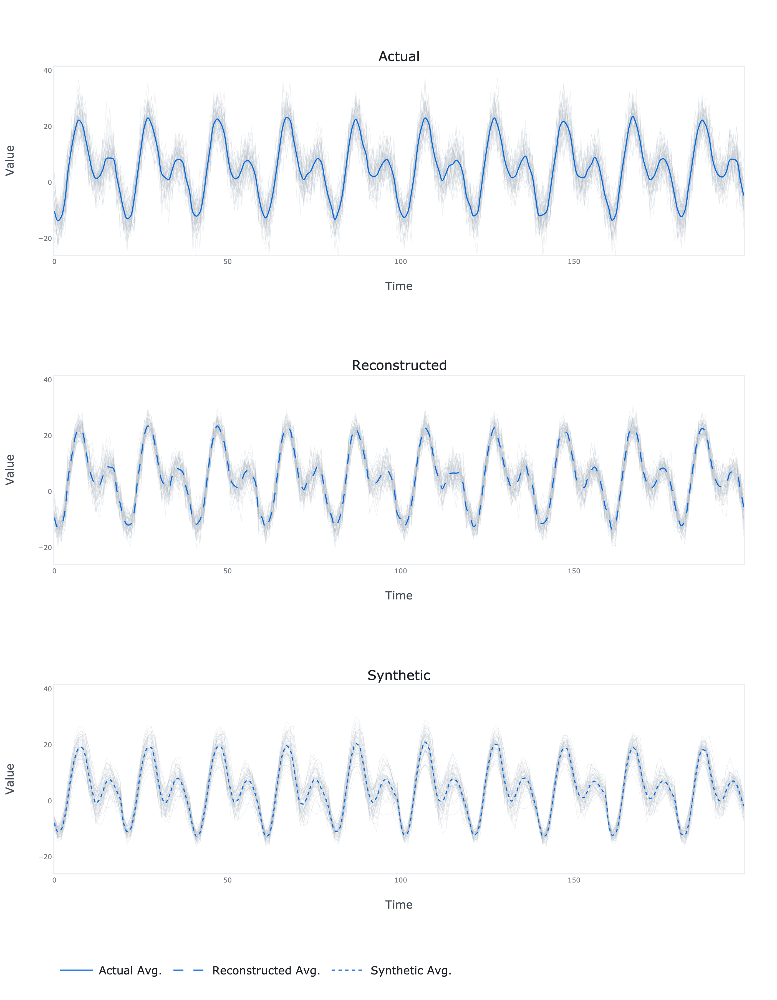

# TimeGAN TensorFlow


TensorFlow implementation of synthetic time series generation model introduced in Yoon, J., Jarrett, D. and Van der Schaar, M., 2019. 
Time-series generative adversarial networks. *Advances in neural information processing systems*, 32.


*Model architecture (source: [NEURIPS 2019](https://papers.nips.cc/paper_files/paper/2019/file/c9efe5f26cd17ba6216bbe2a7d26d490-Paper.pdf))*

## Dependencies
```bash
numpy==1.23.5
tensorflow==2.11.0
plotly==5.11.0
kaleido==0.2.1
```
## Usage
```python
import numpy as np

from time_gan_tensorflow.model import TimeGAN
from time_gan_tensorflow.plots import plot

# Generate the data
N = 50      # number of time series
L = 1000    # length of each time series
t = np.linspace(0, 1, L).reshape(-1, 1)
c = np.cos(2 * np.pi * (50 * t - 0.5))
s = np.sin(2 * np.pi * (100 * t - 0.5))
x = 5 + 10 * c + 10 * s + 5 * np.random.normal(size=(L, N))

# Split the data
x_train, x_test = x[:int(0.8 * L)], x[int(0.8 * L):]

# Fit the model to the training data
model = TimeGAN(
    x=x_train,
    timesteps=20,
    hidden_dim=64,
    num_layers=3,
    lambda_param=0.1,
    eta_param=10,
    learning_rate=0.001,
    batch_size=16
)

model.fit(
    epochs=500,
    verbose=True
)

# Reconstruct the test data
x_hat = model.reconstruct(x=x_test)

# Generate the synthetic data
x_sim = model.simulate(samples=len(x_test))

# Plot the actual, reconstructed and synthetic data
fig = plot(actual=x_test, reconstructed=x_hat, synthetic=x_sim)
fig.write_image('results.png', scale=4, height=900, width=700)
```

